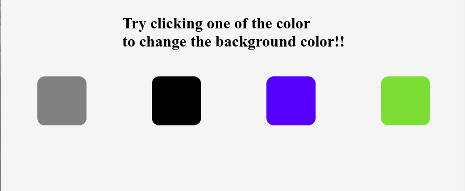

<h1>DOM Manipulation JavaScript Project</h1>

This repository contains a basic project built with JavaScript focusing on DOM manipulation. The project changes the background color of the webpage based on the button clicked by the user.

<h2>Project Overview</h2>

The JavaScript code listens for click events on buttons with the class "button". When a button is clicked, the background color of the webpage is changed accordingly.

<h2>Screenshots</h2>  

<h2>Usage</h2>

Clone the repository to your local machine:

<pre><code>git clone &lt;https://github.com/Dark-Programer/js-background-color-changer.git&gt;</code></pre>

Open the <code>index.html</code> file in your web browser to view the project.

